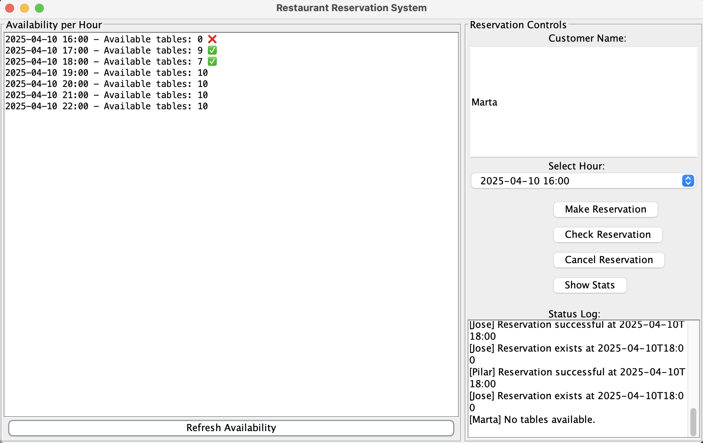

# Restaurant Reservation System

A Java Swing application to simulate a reservation system for a single restaurant with `n` tables.

## Features
- 🖥️ GUI with availability panel and reservation controls  
- ⏰ Hour-based reservations (auto-adjusted to nearest hour)  
- 🧩 Simple model-view separation  

---

## 🖼️ UI Preview

Below is a preview of the application's interface:



---

## How It Works

1. **Availability Panel** shows available tables per hour.
2. **Controls Panel** allows users to:
   - Enter customer name
   - Choose reservation hour
   - Make / check / cancel a reservation
   - View reservation statistics
3. All data is handled through a simple `ReservationSystem` class managing the reservation map.

---

## Run the App

```bash
javac Main.java ReservationDashboard.java ReservationSystem.java
java Main
```